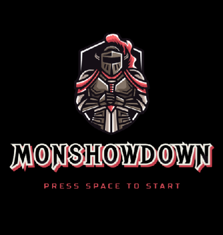
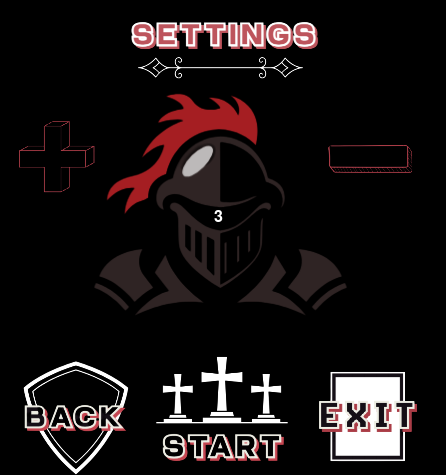
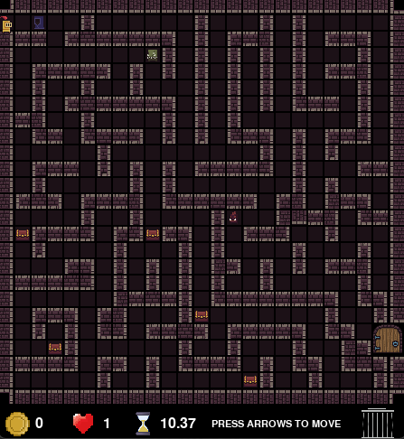
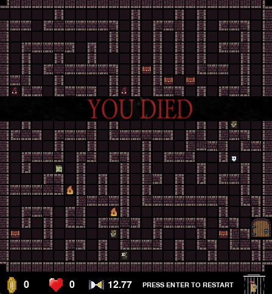
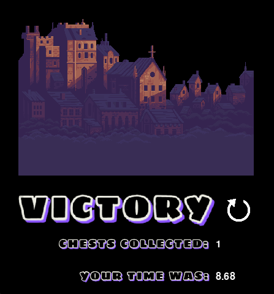

# Monshowdown

# Description
Monshowdown throws you into a thrilling maze challenge where every turn counts. Navigate your way to the exit, 
avoid monsters and capture treasure chests to rack up points. Customize the difficulty by choosing how many 
monsters you’ll face, then see how quickly you can escape without leaving any treasure behind.

# How to Play
- **Menu:** Press **SPACE** to enter the settings menu
- **Settings** Use your **MOUSE** to adjust the number of monsters, start the game, go back, or exit
- **Movement:** Use the **ARROW KEYS** to move your character up, down, left, and right
- **Objective:** Navigate the maze, collect chests, avoid monsters and reach the exit door
- **Chests:** Find and open chests to increase your score (displayed next to the coin)
- **Monsters:** Coming into contact with a monster costs you a life (displayed next to the heart)
- **Restart:** If you die, press **ENTER** to restart the game

# Contact
Reach out to martinle348@gmail.com if you have any questions!

# Screenshots

